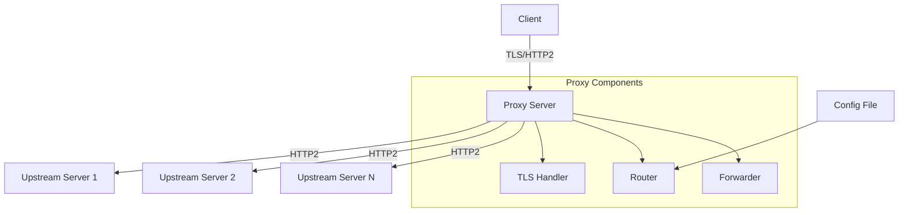

# Design Document: gRPC HTTP Proxy

## Overview

The gRPC HTTP Proxy is a high-performance, Rust-based proxy server that terminates TLS connections and routes gRPC traffic to backend services. Built on the hyper library, it provides HTTP/2 support with ALPN negotiation, HTTP trailer streaming, and intelligent routing based on gRPC service and method names.

The proxy acts as a TLS termination point, accepting encrypted connections from clients and forwarding requests to upstream servers over unencrypted HTTP/2 within the internal network. This design simplifies certificate management while maintaining security boundaries.

## Architecture

### High-Level Architecture



### Component Interaction Flow

1. **TLS Handshake**: Client establishes TLS connection with ALPN negotiation
2. **Request Parsing**: Proxy extracts gRPC service/method from request path
3. **Route Resolution**: Router matches request to upstream server using configuration
4. **Request Forwarding**: Forwarder streams request to selected upstream server
5. **Response Streaming**: Proxy streams response back to client, including trailers

## Components and Interfaces

### 1. TLS Handler Component

**Responsibility**: Manages TLS termination and HTTP/2 connection establishment

**Key Interfaces**:
```rust
pub struct TlsHandler {
    acceptor: TlsAcceptor,
    config: TlsConfig,
}

impl TlsHandler {
    pub async fn accept_connection(&self, stream: TcpStream) -> Result<TlsStream, TlsError>;
    pub fn configure_alpn(&mut self, protocols: Vec<String>);
}
```

**Implementation Details**:
- Uses rustls for TLS implementation
- Configures ALPN to advertise "h2" and "http/1.1" protocols
- Handles certificate loading and validation
- Manages TLS session state

### 2. Router Component

**Responsibility**: Parses gRPC requests and determines upstream server routing

**Key Interfaces**:
```rust
pub struct Router {
    routes: Vec<RoutingRule>,
    catch_all: Option<UpstreamConfig>,
}

pub struct RoutingRule {
    pattern: String,
    upstream: UpstreamConfig,
    priority: u32,
}

impl Router {
    pub fn route_request(&self, path: &str) -> Option<&UpstreamConfig>;
    pub fn load_config(&mut self, config_path: &Path) -> Result<(), ConfigError>;
}
```

**Implementation Details**:
- Parses gRPC URLs in format: `/package.service/method`
- Supports glob patterns for service/method matching
- Implements priority-based routing with most specific matches first
- Maintains routing table from configuration file

### 3. HTTP/2 Forwarder Component

**Responsibility**: Handles HTTP/2 request/response forwarding with trailer support

**Key Interfaces**:
```rust
pub struct Http2Forwarder {
    client_pool: ConnectionPool,
}

impl Http2Forwarder {
    pub async fn forward_request(
        &self,
        request: Request<Body>,
        upstream: &UpstreamConfig,
    ) -> Result<Response<Body>, ForwardError>;
    
    pub async fn stream_with_trailers(
        &self,
        request_stream: impl Stream<Item = Bytes>,
        response_sink: impl Sink<Bytes>,
    ) -> Result<Trailers, StreamError>;
}
```

**Implementation Details**:
- Maintains connection pool to upstream servers
- Preserves HTTP/2 stream semantics
- Handles bidirectional streaming for gRPC
- Forwards trailers in both directions

### 4. Configuration Manager

**Responsibility**: Loads and manages proxy configuration

**Key Interfaces**:
```rust
pub struct ProxyConfig {
    pub listen_addr: SocketAddr,
    pub tls_cert_path: PathBuf,
    pub tls_key_path: PathBuf,
    pub routes: Vec<RoutingRule>,
    pub catch_all_upstream: Option<UpstreamConfig>,
    pub log_level: LogLevel,
}

impl ProxyConfig {
    pub fn from_file(path: &Path) -> Result<Self, ConfigError>;
    pub fn from_args(args: Args) -> Result<Self, ConfigError>;
}
```

## Data Models

### Configuration Schema

```yaml
# proxy-config.yaml
listen:
  address: "0.0.0.0"
  port: 8443

tls:
  cert_file: "/path/to/cert.pem"
  key_file: "/path/to/key.pem"

routing:
  rules:
    - pattern: "/auth.*"
      upstream:
        host: "auth-service"
        port: 9090
    - pattern: "/user.UserService/*"
      upstream:
        host: "user-service"
        port: 9091
  
  catch_all:
    host: "default-service"
    port: 9092

logging:
  level: "info"
```

### Internal Data Structures

```rust
#[derive(Debug, Clone)]
pub struct UpstreamConfig {
    pub host: String,
    pub port: u16,
    pub timeout: Duration,
    pub max_connections: usize,
}

#[derive(Debug)]
pub struct GrpcRequest {
    pub service: String,
    pub method: String,
    pub headers: HeaderMap,
    pub body: Body,
    pub trailers: Option<HeaderMap>,
}
```

## Error Handling

### Error Categories

1. **TLS Errors**: Certificate validation, handshake failures
2. **Routing Errors**: No matching route, invalid configuration
3. **Upstream Errors**: Connection failures, timeouts
4. **Protocol Errors**: Invalid HTTP/2 frames, malformed gRPC requests

### Error Handling Strategy

```rust
#[derive(Debug, thiserror::Error)]
pub enum ProxyError {
    #[error("TLS handshake failed: {0}")]
    TlsHandshake(#[from] rustls::Error),
    
    #[error("No route found for path: {path}")]
    NoRoute { path: String },
    
    #[error("Upstream connection failed: {0}")]
    UpstreamConnection(#[from] hyper::Error),
    
    #[error("Invalid gRPC request: {0}")]
    InvalidGrpc(String),
}
```

**Error Response Strategy**:
- Return appropriate HTTP status codes (502 for upstream failures, 404 for routing failures)
- Log errors with structured logging for observability
- Maintain connection state and attempt graceful degradation
- Implement circuit breaker pattern for upstream failures

## Testing Strategy

### Unit Testing
- Test individual components in isolation
- Mock external dependencies (TLS, network connections)
- Validate routing logic with various URL patterns
- Test configuration parsing and validation

### Integration Testing
- Test complete request flow from client to upstream
- Validate TLS handshake and ALPN negotiation
- Test HTTP/2 streaming and trailer forwarding
- Verify error handling and recovery scenarios

### Performance Testing
- Benchmark concurrent connection handling
- Measure latency overhead introduced by proxy
- Test memory usage under load
- Validate HTTP/2 multiplexing efficiency

### Test Infrastructure
```rust
#[cfg(test)]
mod tests {
    use super::*;
    use tokio_test;
    
    #[tokio::test]
    async fn test_grpc_routing() {
        // Test routing logic
    }
    
    #[tokio::test]
    async fn test_trailer_forwarding() {
        // Test HTTP trailer streaming
    }
}
```

## Implementation Considerations

### Performance Optimizations
- Use connection pooling for upstream connections
- Implement zero-copy streaming where possible
- Leverage Rust's ownership system for memory efficiency
- Use async/await for non-blocking I/O operations

### Security Considerations
- Validate all configuration inputs
- Implement proper certificate validation
- Use secure defaults for TLS configuration
- Log security-relevant events for auditing

### Operational Considerations
- Provide health check endpoints
- Implement graceful shutdown handling
- Support configuration hot-reloading
- Include comprehensive logging and metrics